# Claude Code Project Configuration Guide


## Table of Contents

- [Overview](#overview)
- [1. Configuration Hierarchy](#1-configuration-hierarchy)
- [2. RAI/RAO Framework](#2-rairao-framework)
- [3. Global Rules Inheritance](#3-global-rules-inheritance)
- [4. Project CLAUDE.md Configuration](#4-project-claudemd-configuration)
- [5. Project config.yaml Configuration](#5-project-configyaml-configuration)
- [6. Task Size Classification](#6-task-size-classification)
- [7. Quality Assurance Workflow](#7-quality-assurance-workflow)
- [8. Migration Guide](#8-migration-guide)
- [9. Best Practices](#9-best-practices)
- [10. Troubleshooting](#10-troubleshooting)

## Overview

This guide defines the configuration system for Claude Code projects, focusing on quality assurance through RAI/RAO framework and hierarchical rule inheritance.

### Architecture Principles (v2.0)

```
Global Rules (CLAUDE.md) → Project Rules → RAI/RAO → Evaluation
```

### Configuration Files

| File | Location | Purpose | Priority |
|------|----------|---------|----------|
| **Global CLAUDE.md** | `~/.claude/CLAUDE.md` | Universal rules, RAI/RAO framework | Inherited |
| **Project CLAUDE.md** | `project/CLAUDE.md` | Project-specific extensions | Highest |
| **Global config.yaml** | Template only | Standard configuration template | Base |
| **Project config.yaml** | `project/.claude/config.yaml` | Project configuration with RAI settings | Project |
| **settings.json** | `~/.claude/settings.json` or `.claude/settings.json` | Hooks configuration | Runtime |

---

## 1. Configuration Hierarchy

### Priority Order (Highest to Lowest)

```
1. Project CLAUDE.md (Extends global, never replaces)
   ↓
2. Global CLAUDE.md (Core rules - always apply)
   ↓
3. Project config.yaml (RAI/RAO settings, agent mappings)
   ↓
4. Skills (Loaded per config.yaml)
```

### Key Principle: Extension, Not Replacement

Project configurations **EXTEND** global rules, they never replace them. This ensures:
- Consistent quality standards across all projects
- RAI/RAO framework always available
- Core delegation mappings preserved

---

## 2. RAI/RAO Framework

### What is RAI/RAO?

**RAI (Requirement Achievement Indicators)**: Measurable criteria for deliverable evaluation
**RAO (Requirement Achievement Objectives)**: Clear goals for implementation

### When RAI/RAO is Required

| Task Size | Lines of Code | RAI Required | Evaluation Required |
|-----------|---------------|--------------|---------------------|
| **Trivial** | < 3 | No | No |
| **Small** | < 50 | No | Yes |
| **Medium** | 50-200 | **Yes** | Yes |
| **Large** | > 200 | **Yes (Full)** | Yes |

### RAI Document Structure

```yaml
# RAI-2025-11-08-001.yaml
requirement_achievement:
  task_classification:
    size: medium
    complexity: medium

  indicators:  # RAI - What we measure
    completeness:
      - id: "RAI-COMP-001"
        indicator: "All API endpoints implemented"
        measurement_method: "Endpoint test coverage"
        pass_threshold: "100%"
        priority: must

  objectives:  # RAO - What we aim to achieve
    primary:
      - id: "RAO-PRIM-001"
        objective: "Complete user authentication"
        success_definition: "Users can login/logout"

  evaluation_protocol:
    agent: deliverable-evaluator
    input: "This RAI document"
```

---

## 3. Global Rules Inheritance

### Mandatory Global Rules (From `~/.claude/CLAUDE.md`)

Every project inherits these rules automatically:

1. **Task Size Classification Matrix**
2. **RAI/RAO Framework Requirements**
3. **5-Tool Check Rule**
4. **Agent Delegation Mappings**
5. **Quality Gates**

### How Inheritance Works

```yaml
# In Project CLAUDE.md (REQUIRED STRUCTURE)

## 🔗 GLOBAL RULES INHERITANCE (MANDATORY - DO NOT REMOVE)

This project inherits ALL global rules from ~/.claude/CLAUDE.md

### ✅ Core Global Rules (Always Apply)
1. RAI/RAO Framework (Sections 11-12)
2. Orchestrator Decision Matrix (Section 11)
3. 5-Tool Check Rule (Section 2)
4. Delegation Mapping (Section 4)

---

## Project-Specific Extensions
[Your project-specific rules here - these EXTEND, not replace]
```

---

## 4. Project CLAUDE.md Configuration

### Required Structure

```markdown
# Project-Specific Claude Code Guidelines

## 🔗 GLOBAL RULES INHERITANCE (MANDATORY - DO NOT REMOVE)
[Inheritance declaration - see template]

## 📋 Project Overview
[Project description]

## 🛠️ Technology Stack
[Technologies used]

## 📐 Project-Specific Rules
[Rules that EXTEND global rules]

## 🔄 RAI/RAO Framework Usage
[Any project-specific adjustments - cannot relax global requirements]

## ✅ Quality Gates
Must pass ALL global gates PLUS:
- [ ] Project-specific requirements

## ⚠️ IMPORTANT REMINDERS
1. This file EXTENDS, never REPLACES global rules
2. When in doubt, global rules take precedence
3. Check ~/.claude/CLAUDE.md for complete global rules
```

### What to Include

✅ **SHOULD Include:**
- Project-specific conventions
- Additional quality gates
- Custom workflows
- Technology-specific patterns
- Business domain rules

❌ **SHOULD NOT Include:**
- Language standards (→ Skills)
- Framework conventions (→ Skills)
- Generic patterns (→ Global or Skills)
- Relaxation of global rules

---

## 5. Project config.yaml Configuration

### Essential Sections for RAI/RAO

```yaml
# .claude/config.yaml

# REQUIRED: Quality Assurance Configuration
quality_assurance:
  rai_rao_enabled: true

  task_size_thresholds:
    trivial:
      lines_of_code: 3
      rai_required: false
    small:
      lines_of_code: 50
      rai_required: false
      evaluation_required: true
    medium:
      lines_of_code: 200
      rai_required: true      # MANDATORY
      evaluation_required: true
    large:
      lines_of_code: 201
      rai_required: true      # MANDATORY
      workflow_orchestrator: mandatory

# REQUIRED: Agent Skills with RAI support
agent_skills:
  requirement-analyst:
    - generic/requirement-analyzer  # Includes RAI/RAO

  deliverable-evaluator:
    - generic/evaluation-criteria   # RAI-aware evaluation

# REQUIRED: Workflow paths
workflow:
  documentation:
    structure:
      requirements: ".work/requirements/"  # RAI documents
      evaluation_history: ".work/evaluation-history.yaml"
      metrics: ".work/metrics.yaml"
```

### Agent Enforcement Policy

```yaml
agent_enforcement:
  enabled: true
  policy: "agent-first"

  required_agents:
    requirement_analysis:
      agent: requirement-analyst
      description: "Generate RAI/RAO for medium/large tasks"
      triggers:
        task_patterns:
          - "New feature implementation"
          - "Architecture changes"
```

---

## 6. Task Size Classification

### Automatic Routing Based on Size

```mermaid
graph TD
    A[User Request] --> B{Estimate Task Size}
    B -->|< 3 lines| C[Trivial: Direct execution]
    B -->|< 50 lines| D[Small: Agent recommended]
    B -->|50-200 lines| E[Medium: RAI required]
    B -->|> 200 lines| F[Large: Full RAI/RAO + Orchestrator]

    D --> G[Evaluation required]
    E --> H[Generate RAI → Implement → Evaluate]
    F --> I[Full workflow with iterations]
```



### Size Estimation Guidelines

- **Trivial**: Typo fixes, whitespace, single variable rename
- **Small**: Single function, bug fix in one file
- **Medium**: Multiple functions, cross-file changes
- **Large**: New features, architecture changes, modules

---

## 7. Quality Assurance Workflow

### Standard Workflow (All Projects)

```
1. Task Classification
   ↓
2. RAI Generation (if medium/large)
   ↓
3. Implementation (with appropriate agent)
   ↓
4. Evaluation against RAI
   ↓
5. Iteration (if needed, max 3)
```

### Metrics Tracking

Projects automatically track:
- Agent usage rate
- RAI compliance rate
- Evaluation pass rate
- Average iterations

Access metrics:
```bash
~/.claude/scripts/metrics-collector.sh
```

---

## 8. Migration Guide

### For Existing Projects

1. **Add inheritance section to CLAUDE.md:**
```markdown
## 🔗 GLOBAL RULES INHERITANCE (MANDATORY - DO NOT REMOVE)
[Copy from template]
```

2. **Add quality_assurance to config.yaml:**
```yaml
quality_assurance:
  rai_rao_enabled: true
  task_size_thresholds:
    [Copy from template]
```

3. **Update agent_skills:**
```yaml
agent_skills:
  requirement-analyst:
    - generic/requirement-analyzer  # Now includes RAI/RAO
```

4. **Create .work structure:**
```bash
mkdir -p .work/requirements
touch .work/evaluation-history.yaml
touch .work/metrics.yaml
```

---

## 9. Best Practices

### DO's ✅

1. **Always check task size first**
2. **Generate RAI for medium/large tasks**
3. **Use TodoWrite to track progress**
4. **Evaluate deliverables against RAI**
5. **Store RAI documents in .work/requirements/**
6. **Reference RAI in commit messages**

### DON'Ts ❌

1. **Never skip RAI for medium/large tasks**
2. **Never relax global requirements**
3. **Never bypass evaluation**
4. **Never ignore 5-tool check**
5. **Never replace global rules**

### Commit Message Format

```
type: description [RAI-YYYY-MM-DD-XXX]
```

Examples:
- `feat: Add user auth [RAI-2025-11-08-001]`
- `fix: Resolve timeout [RAI-2025-11-08-002]`

---

## 10. Troubleshooting

### Common Issues and Solutions

#### Issue: RAI not generated for medium task
**Solution**: Check `quality_assurance.rai_rao_enabled: true` in config.yaml

#### Issue: Evaluation skipped
**Solution**: Ensure `deliverable-evaluator` has RAI document path

#### Issue: Global rules not applying
**Solution**: Add inheritance section to project CLAUDE.md

#### Issue: Metrics not collecting
**Solution**: Create `.work/` directory structure

### Validation Checklist

- [ ] Project CLAUDE.md has inheritance section
- [ ] config.yaml has quality_assurance section
- [ ] .work/requirements/ directory exists
- [ ] requirement-analyst skill includes RAI/RAO
- [ ] deliverable-evaluator is RAI-aware

### Support Commands

```bash
# Check configuration
cat .claude/config.yaml | grep -A10 quality_assurance

# Verify RAI documents
ls -la .work/requirements/

# View metrics
cat .work/metrics.yaml

# Run evaluation history analysis
~/.claude/scripts/feedback-analyzer.sh
```

---

## Templates

Complete templates are available at:
- `~/.dotfiles/.claude/projects/template/CLAUDE.md`
- `~/.dotfiles/.claude/projects/template/config.yaml`
- `~/.dotfiles/.claude/projects/template/.claude/settings.json`

## Version History

- **v2.0.0** (2025-11-08): RAI/RAO framework, global inheritance
- **v1.0.0**: Initial skill-driven architecture

## License

MIT License - See LICENSE file for details