# Claude Code Agent Orchestration System

[](https://opensource.org/licenses/MIT)
[](https://claude.ai/code)
[](#)
[](#)
[](#)
[](#)
[](https://claude.ai)

A multi-agent orchestration system for [Claude Code](https://docs.anthropic.com/en/docs/claude-code) that enables consistent, reusable AI-assisted development across multiple projects and technology stacks.

## Why This System?

When using Claude Code for complex projects, you may face these challenges:

| Challenge | Without This System | With This System |
|-----------|---------------------|------------------|
| **Inconsistent quality** | AI may skip tests or reviews | Enforced quality gates before completion |
| **Repeated explanations** | Re-explain project rules every session | Rules loaded automatically from config |
| **Complex task handling** | Manual breakdown of large tasks | Automatic routing to specialized agents |
| **Technology switching** | Different prompts for each stack | Skills adapt agents to any technology |

## Table of Contents

- [Quick Start](#quick-start)
- [Key Features](#key-features)
- [Installation](#installation)
- [Getting Started](#getting-started)
- [Configuration](#configuration)
- [Architecture Overview](#architecture-overview)
- [Reference](#reference)
- [License](#license)

## Quick Start

```bash
# 1. Clone to ~/.claude/
git clone https://github.com/your-repo/claude-orchestration.git ~/.claude

# 2. Install yq (required for config loading)
brew install yq

# 3. Create project configuration
mkdir -p /path/to/your/project/.claude
cp ~/.claude/templates/.claude/config.yaml /path/to/your/project/.claude/

# 4. (Optional) Create CLAUDE.md for project-specific context
# Add business rules, prohibited patterns, architecture decisions

# 5. Start Claude Code
cd /path/to/your/project
claude
```

That's it! Use `/dev-workflow` when you need the full orchestration system.

## Key Features

| Feature | Description |
|---------|-------------|
| **On-Demand Workflow** | Invoke via `/dev-workflow` command - not always-on |
| **Skill-Based Adaptation** | Same agents work with PHP, TypeScript, React, etc. via loadable skills |
| **Quality Gates** | Automatic code review and acceptance criteria verification |
| **Project Rules as Config** | Define constraints in YAML, enforced automatically |
| **Multi-Project Support** | One system, multiple projects with different tech stacks |

## Installation

### Prerequisites

- [Claude Code](https://docs.anthropic.com/en/docs/claude-code) - Anthropic's CLI tool
- **yq** - YAML processor (used by skills to read config)
  ```bash
  brew install yq   # macOS
  # or: pip install yq
  ```

### Setup

```bash
# Clone this repository to ~/.claude/
git clone https://github.com/your-repo/claude-orchestration.git ~/.claude

# Verify installation
ls ~/.claude/agents/    # Should show agent definitions
ls ~/.claude/skills/    # Should show skill definitions
```

## Getting Started

### 1. Create project configuration

```bash
mkdir -p /path/to/project/.claude
cp ~/.claude/templates/.claude/config.yaml /path/to/project/.claude/config.yaml
```

### 2. Configure your project

**`.claude/config.yaml`** - Machine-readable settings:
- Agent skill assignments (defines your tech stack)
- Test commands
- Constraints as natural language rules

**(Optional) `CLAUDE.md`** - Human-readable project context:
- Business rules with reasons and code examples
- Prohibited patterns with explanations
- Architecture decisions

### 3. Start Claude Code

```bash
cd /path/to/project
claude
```

By default, Claude Code operates in direct execution mode. For complex tasks, use:

```
/dev-workflow
Implement user authentication with JWT tokens.

Requirements:
- Login/logout endpoints
- Token refresh mechanism
- Session management
```

The `/dev-workflow` command:
1. Invokes the `main-orchestrator` agent
2. Classifies and routes your request
3. Enforces quality gates before completion

## Configuration

Configuration lives in `.claude/config.yaml`. Here's what each section does:

| Section | Purpose | Example |
|---------|---------|---------|
| `agents.*` | Which skills each agent loads | `code-developer: [php/coding-standards]` |
| `constraints.*` | Rules enforced during development | Natural language prohibitions |
| `testing.*` | Test execution settings | Docker command, documentation path |
| `git.*` | Git operation policy | auto/user_request_only/prohibited |

### Example Configuration

```yaml
# Define your tech stack via agent skills
agents:
  code-developer:
    skills:
      - php/coding-standards
      - php-cakephp/code-implementer

# Project constraints (natural language rules)
constraints:
  architecture:
    layers:
      - "Controller must not contain business logic."
    dependencies:
      - "No circular dependencies between Models."
  testing:
    prohibited:
      - "Do not mock production code."

# Git settings
git:
  operations:
    commit: user_request_only
    push: user_request_only
```

### Where to Put Information

| Information | Location | Required |
|-------------|----------|----------|
| Agent skill assignments | `.claude/config.yaml` | Yes |
| Constraints as rules | `.claude/config.yaml` | Yes |
| Test commands | `.claude/config.yaml` | Yes |
| Business rules with code examples | `CLAUDE.md` (optional) | No |

## Architecture Overview

The orchestration system is invoked via the `/dev-workflow` command. This triggers the `main-orchestrator` agent which coordinates the workflow below.

```mermaid
flowchart TD
    subgraph Entry["🚪 Entry Layer"]
        A[User Request] --> B0[main-orchestrator]
        B0 --> B[quick-classifier]
    end

    subgraph Analysis["🔍 Analysis Layer"]
        B --> C{Trivial?}
        C -->|Yes| D[main-orchestrator<br/>Direct Execution]
        C -->|No| G[goal-clarifier]
        G --> H{Needs<br/>Clarification?}
        H -->|Yes| I[main-orchestrator<br/>Ask User]
        I --> G
        H -->|No| J[task-scale-evaluator]
    end

    subgraph Implementation["⚙️ Implementation Layer"]
        J -->|task object| M[workflow-orchestrator]
        M --> L[code-developer]
        L --> N[test-executor]
        N --> O{Tests Pass?}
        O -->|No| P[test-failure-debugger]
        P --> L
    end

    subgraph Quality["✅ Quality Layer"]
        O -->|Yes| Q[quality-reviewer]
        Q --> R[deliverable-evaluator]
        R --> S{Criteria<br/>Met?}
        S -->|No| L
    end

    subgraph Report["📋 Report Layer"]
        S -->|Yes| T[main-orchestrator<br/>Report Results]
        D --> T
        T --> U[Complete]
    end

    style Entry fill:#e3f2fd,stroke:#1976d2
    style Analysis fill:#fff8e1,stroke:#f9a825
    style Implementation fill:#e8f5e9,stroke:#388e3c
    style Quality fill:#fce4ec,stroke:#c2185b
    style Report fill:#f3e5f5,stroke:#7b1fa2
```



**Data Flow**: `task` object (with `acceptance_criteria`) flows through GC → TSE → WO → DE via prompt.

### How It Works

When you invoke `/dev-workflow`:

1. **Entry**: Your request is handled by `main-orchestrator` agent
2. **Classification**: `quick-classifier` determines if request is trivial or complex
3. **Triage**: Trivial tasks execute directly; complex ones go through `goal-clarifier` (which defines `task` with `acceptance_criteria`)
4. **Implementation**: `task-scale-evaluator` passes `task` object to `workflow-orchestrator`, which manages `code-developer` → `test-executor`
5. **Quality**: `quality-reviewer` checks code, `deliverable-evaluator` extracts `acceptance_criteria` from `task` and verifies
6. **Report**: Results returned to you

**Note**: If `goal-clarifier` needs user input, it returns to `main-orchestrator` with questions; MO asks user and resumes GC.

**Without `/dev-workflow`**: Claude Code operates in direct execution mode with full tool access.

### Key Agents

| Agent | What It Does |
|-------|--------------|
| quick-classifier | Decides if request is simple or complex |
| goal-clarifier | Defines `task` object with `acceptance_criteria` |
| code-developer | Writes code following loaded skills |
| test-executor | Runs tests and reports results |
| quality-reviewer | Reviews code for quality and security |
| deliverable-evaluator | Extracts `acceptance_criteria` from `task` and evaluates |

## Reference

<details>
<summary><strong>Agent Reference (12 agents)</strong></summary>

| Agent | Responsibility | Action |
|-------|----------------|--------|
| quick-classifier | Request classification | Direct execution eligibility |
| goal-clarifier | Requirement analysis | Acceptance criteria definition |
| main-orchestrator | Task routing | Delegate to appropriate agents |
| task-scale-evaluator | Complexity assessment | Simple/complex determination |
| design-architect | Architecture design | Technical design and patterns |
| code-developer | Code implementation | Write code following skills |
| test-strategist | Test planning | Test strategy and case design |
| test-executor | Test execution | Run tests and determine pass/fail |
| test-failure-debugger | Failure analysis | Root cause investigation |
| quality-reviewer | Quality review | Code quality and security check |
| deliverable-evaluator | Acceptance verification | Match against criteria |
| workflow-orchestrator | Workflow coordination | Multi-agent collaboration |

</details>

<details>
<summary><strong>Skill Reference (37 skills)</strong></summary>

### Generic Skills (12)

| Skill | Description |
|-------|-------------|
| acceptance-criteria | Acceptance criteria patterns |
| code-reviewer | Universal code review patterns |
| completion-evaluator | Task completion verification |
| delegation-router | Agent delegation patterns |
| deliverable-validator | Deliverable validation rules |
| design-patterns | SOLID, DRY, KISS patterns |
| evaluation-criteria | Final evaluation standards |
| git-operator | Git operation patterns |
| requirement-analyzer | Requirement analysis patterns |
| task-scaler | Task complexity evaluation |
| test-implementer | Test implementation patterns |
| workflow-patterns | Workflow coordination patterns |

### PHP Skills (3)

| Skill | Description |
|-------|-------------|
| coding-standards | PSR-12 and PHP best practices |
| security-patterns | OWASP, input validation |
| testing-standards | PHPUnit best practices |

### PHP-CakePHP Skills (12)

| Skill | Description |
|-------|-------------|
| code-implementer | CakePHP MVC patterns |
| code-reviewer | CakePHP code review |
| database-designer | Database schema design |
| fixture-generator | Test fixture generation |
| functional-designer | Functional specification |
| migration-checker | Migration validation |
| multi-tenant-db-handler | Multi-tenant patterns |
| refactoring-advisor | Refactoring recommendations |
| requirement-analyzer | CakePHP requirements |
| test-case-designer | Test case design |
| test-validator | Test quality validation |

### TypeScript Skills (10)

| Skill | Description |
|-------|-------------|
| typescript/coding-standards | TypeScript best practices |
| typescript-react/* | React patterns (5 skills) |
| typescript-nextjs/* | Next.js patterns (3 skills) |
| typescript-react-query/patterns | TanStack Query patterns |
| typescript-zustand/patterns | Zustand state patterns |

</details>

<details>
<summary><strong>Hook Usage Matrix (Advanced)</strong></summary>

### Agent Hooks

| Agent | SessionStart | PreToolUse | SubagentStop | Stop |
|-------|:------------:|:----------:|:------------:|:----:|
| quick-classifier | - | - | - | - |
| goal-clarifier | - | - | ✅️ | - |
| main-orchestrator | - | - | - | ✅️ |
| task-scale-evaluator | - | - | ✅️ | - |
| design-architect | - | - | ✅️ | - |
| code-developer | - | ✅️ | ✅️ | - |
| test-strategist | - | - | ✅️ | - |
| test-executor | - | - | ✅️ | - |
| test-failure-debugger | - | - | ✅️ | - |
| quality-reviewer | - | - | ✅️ | - |
| deliverable-evaluator | ✅️ | ✅️ | ✅️ | - |
| workflow-orchestrator | - | - | ✅️ | - |

### Skill Hooks (Config Loading)

| Skill | SessionStart | PostToolUse | config.yaml Key |
|-------|:------------:|:-----------:|-----------------|
| generic/git-operator | ✅️ | - | `.output.language`, `.git` |
| generic/test-implementer | ✅️ | - | `.testing`, `.constraints.testing` |
| generic/task-scaler | ✅️ | - | `.task_scaling.thresholds` |
| generic/code-reviewer | ✅️ | - | `.constraints` |
| php/coding-standards | ✅️ | ✅️ | `.coding_standards` |
| typescript/coding-standards | ✅️ | ✅️ | `.coding_standards` |
| php-cakephp/test-validator | ✅️ | - | `.constraints.testing`, `.constraints.schema` |
| php-cakephp/code-implementer | ✅️ | - | `.constraints.architecture` |
| php-cakephp/code-reviewer | ✅️ | - | `.constraints.architecture`, `.constraints` |

**Architecture Principle:**
- **Skills**: Load project-specific rules via `yq` from `.claude/config.yaml`
- **Agents**: Chain control only (SubagentStop, Stop) - no rule-based hooks

</details>

<details>
<summary><strong>Skill Usage Matrix (Advanced)</strong></summary>

| Agent | Uses Skills |
|-------|-------------|
| goal-clarifier | requirement-analyzer, acceptance-criteria |
| main-orchestrator | workflow-patterns, task-scaler, delegation-router |
| task-scale-evaluator | requirement-analyzer, task-scaler |
| design-architect | design-patterns |
| test-executor | test-implementer |
| quality-reviewer | code-reviewer |
| deliverable-evaluator | completion-evaluator, evaluation-criteria, deliverable-validator |
| workflow-orchestrator | git-operator |

Language/Framework skills (e.g., `php-cakephp/*`) are loaded per-project via `agents.*.skills` in config.yaml.

</details>

## License

MIT License - See [LICENSE](LICENSE) file for details.

---

**Version**: 2.2.0
**Last Updated**: 2025-01-12
