# Claude Code Agent Orchestration System

[](https://opensource.org/licenses/MIT)
[](https://claude.ai/code)
[](#)
[](#)
[](#)
[](#)
[](https://claude.ai)

A multi-agent orchestration system for Claude Code that enables consistent, reusable AI-assisted development across multiple projects and technology stacks through skill-driven architecture.

## Table of Contents

- [Introduction](#introduction)
- [Key Features](#key-features)
- [Architecture Workflow](#architecture-workflow)
- [Hook Usage Matrix](#hook-usage-matrix)
- [Skill Usage Matrix](#skill-usage-matrix)
- [Agent Role Reference](#agent-role-reference)
- [Skill Reference](#skill-reference)
- [Getting Started](#getting-started)
- [Configuration](#configuration)
- [License](#license)

## Introduction

This system implements a sophisticated multi-agent architecture where specialized agents collaborate through a central orchestrator. The design follows a **Two-Phase Triage** approach that efficiently classifies incoming requests and routes them to appropriate handlers, ensuring optimal resource utilization and consistent quality across all operations.

## Key Features

- **Two-Phase Triage**: Efficient request classification before deep analysis
- **Skill-Based Adaptation**: Generic agents adapt to any technology through loadable skills
- **Separation of Concerns**: Clear responsibility boundaries between agents
- **Quality Gates**: Built-in review and evaluation checkpoints
- **Multi-Project Support**: Centralized configuration with project-specific overrides

## Architecture Workflow

```mermaid
flowchart TD
    subgraph Entry["🚪 Entry Layer"]
        A[User Request] --> B[quick-classifier]
    end

    subgraph Analysis["🔍 Analysis Layer"]
        B --> C{Trivial?}
        C -->|Yes| D[main-orchestrator<br/>Direct Execution]
        C -->|No| G[goal-clarifier]
        G --> H{Needs<br/>Clarification?}
        H -->|Yes| I[main-orchestrator<br/>Ask User]
        I --> G
        H -->|No| J[task-scale-evaluator]
        J --> K{Scale?}
    end

    subgraph Implementation["⚙️ Implementation Layer"]
        K -->|Complex| M[workflow-orchestrator]
        K -->|Simple| L[code-developer]
        M --> L
        L --> N[test-executor]
        N --> O{Tests Pass?}
        O -->|No| P[test-failure-debugger]
        P --> L
    end

    subgraph Quality["✅ Quality Layer"]
        O -->|Yes| Q[quality-reviewer]
        Q --> R[deliverable-evaluator]
        R --> S{Criteria<br/>Met?}
        S -->|No| L
    end

    G -.->|Acceptance Criteria| R

    subgraph Report["📋 Report Layer"]
        S -->|Yes| T[main-orchestrator<br/>Report Results]
        D --> T
        T --> U[Complete]
    end

    style Entry fill:#e3f2fd,stroke:#1976d2
    style Analysis fill:#fff8e1,stroke:#f9a825
    style Implementation fill:#e8f5e9,stroke:#388e3c
    style Quality fill:#fce4ec,stroke:#c2185b
    style Report fill:#f3e5f5,stroke:#7b1fa2
```



### Direct Execution Limits (Trivial Tasks)

| Limit | Value |
|-------|-------|
| max_file_reads | 3 |
| max_search_iterations | 2 |
| allowed_operations | read, search, list |

## Hook Usage Matrix

### Agent Hooks (Chain Control Only)

| Agent | SessionStart | PreToolUse | SubagentStop | Stop |
|-------|:------------:|:----------:|:------------:|:----:|
| quick-classifier | - | - | - | - |
| goal-clarifier | - | - | 💬 | - |
| main-orchestrator | - | - | - | 💬 |
| task-scale-evaluator | - | - | 💬 | - |
| design-architect | - | - | 💬 | - |
| code-developer | - | 💬 | 💬 | - |
| test-strategist | - | - | 💬 | - |
| test-executor | - | - | 💬 | - |
| test-failure-debugger | - | - | 💬 | - |
| quality-reviewer | - | - | 💬 | - |
| deliverable-evaluator | 💬 | 💬 | 💬 | - |
| workflow-orchestrator | - | - | 💬 | - |

### Skill Hooks (Config Loading & Validation)

| Skill | SessionStart | PostToolUse |
|-------|:------------:|:-----------:|
| generic/test-implementer | ⌘ (testing rules) | - |
| generic/task-scaler | ⌘ (scale config) | - |
| typescript/coding-standards | ⌘ (coding standards) | ⌘ (eslint) |
| php/coding-standards | ⌘ (coding standards) | ⌘ (php -l) |

**Legend:** ⌘ = shell script hook (uses yq for config), 💬 = prompt injection hook

### Architecture Principle

- **Skills**: Load project-specific rules via `yq` from `.claude/config.yaml`
- **Agents**: Chain control only (SubagentStop, Stop) - no rule-based hooks

> **Exception**: deliverable-evaluator has a SessionStart prompt hook for loading evaluation context from the prompt (not config loading).


## Skill Usage Matrix

### Generic Skills

| Agent | req-analyzer | accept-criteria | workflow-pat | task-scaler | deleg-router | design-pat | test-impl | code-rev | compl-eval | eval-criteria | deliv-valid | git-op |
|-------|:---:|:---:|:---:|:---:|:---:|:---:|:---:|:---:|:---:|:---:|:---:|:---:|
| quick-classifier | - | - | - | - | - | - | - | - | - | - | - | - |
| goal-clarifier | ✅️ | ✅️ | - | - | - | - | - | - | - | - | - | - |
| main-orchestrator | - | - | ✅️ | ✅️ | ✅️ | - | - | - | - | - | - | - |
| task-scale-evaluator | ✅️ | - | - | ✅️ | - | - | - | - | - | - | - | - |
| design-architect | - | - | - | - | - | ✅️ | - | - | - | - | - | - |
| code-developer | - | - | - | - | - | - | - | - | - | - | - | - |
| test-strategist | - | - | - | - | - | - | - | - | - | - | - | - |
| test-executor | - | - | - | - | - | - | ✅️ | - | - | - | - | - |
| test-failure-debugger | - | - | - | - | - | - | - | - | - | - | - | - |
| quality-reviewer | - | - | - | - | - | - | - | ✅️ | - | - | - | - |
| deliverable-evaluator | - | - | - | - | - | - | - | - | ✅️ | ✅️ | ✅️ | - |
| workflow-orchestrator | - | - | - | - | - | - | - | - | - | - | - | ✅️ |

**Legend:** req-analyzer = requirement-analyzer, accept-criteria = acceptance-criteria, workflow-pat = workflow-patterns, deleg-router = delegation-router, design-pat = design-patterns, test-impl = test-implementer, code-rev = code-reviewer, compl-eval = completion-evaluator, eval-criteria = evaluation-criteria, deliv-valid = deliverable-validator, git-op = git-operator

### Language/Framework Skills (configured per project)

| Agent | Loads From Config |
|-------|-------------------|
| code-developer | `language/*`, `framework/*` (e.g., php/coding-standards, typescript-react/code-implementer) |
| test-strategist | `language/testing-standards`, `framework/test-*` |
| quality-reviewer | `language/*-standards`, `framework/code-reviewer` |
| design-architect | `framework/*-designer` |

## Agent Role Reference

| Agent | Responsibility | Action |
|-------|----------------|--------|
| quick-classifier | Request classification | Direct execution eligibility |
| goal-clarifier | Requirement analysis | Acceptance criteria definition, clarifying questions |
| main-orchestrator | Task routing | Delegate to appropriate agents |
| task-scale-evaluator | Complexity assessment | Simple/complex determination |
| design-architect | Architecture design | Technical design and patterns |
| code-developer | Code implementation | Write code following skills |
| test-strategist | Test planning | Test strategy and case design |
| test-executor | Test execution | Run tests and determine pass/fail |
| test-failure-debugger | Failure analysis | Root cause investigation and fix suggestions |
| quality-reviewer | Quality review | Code quality and security check |
| deliverable-evaluator | Acceptance verification | Match against acceptance criteria |
| workflow-orchestrator | Workflow coordination | Multi-agent collaboration |

## Skill Reference

### Generic Skills (12)

| Skill | Description |
|-------|-------------|
| acceptance-criteria | Defines acceptance criteria patterns and validation rules |
| code-reviewer | Universal code review patterns and checklists |
| completion-evaluator | Task completion verification criteria |
| delegation-router | Agent delegation decision patterns |
| deliverable-validator | Deliverable validation rules and quality checks |
| design-patterns | SOLID, DRY, KISS, and architectural patterns |
| evaluation-criteria | Final evaluation standards and metrics |
| git-operator | Git operation patterns and commit message standards |
| requirement-analyzer | Requirement analysis and documentation patterns |
| task-scaler | Task complexity evaluation criteria |
| test-implementer | Test implementation patterns and best practices |
| workflow-patterns | Multi-step workflow coordination patterns |

### PHP Skills (3)

| Skill | Description |
|-------|-------------|
| coding-standards | PSR-12 coding standards and PHP best practices |
| security-patterns | OWASP patterns, input validation, SQL injection prevention |
| testing-standards | PHPUnit best practices and testing patterns |

### PHP-CakePHP Skills (12)

| Skill | Description |
|-------|-------------|
| code-implementer | CakePHP MVC implementation patterns |
| code-reviewer | CakePHP-specific code review checklist |
| database-designer | Database schema design for CakePHP |
| fixture-generator | Test fixture generation patterns |
| functional-designer | Functional specification design |
| migration-checker | Migration validation and verification |
| multi-tenant-db-handler | Multi-tenant database patterns |
| refactoring-advisor | CakePHP refactoring recommendations |
| requirement-analyzer | CakePHP-specific requirement analysis |
| test-case-designer | Test case design for CakePHP |
| test-validator | Test quality and specification validation |

### TypeScript Skills (10)

| Skill | Description |
|-------|-------------|
| typescript/coding-standards | TypeScript coding standards and best practices |
| typescript-react/architectural-patterns | React architectural patterns and component design |
| typescript-react/code-implementer | React component implementation patterns |
| typescript-react/code-reviewer | React-specific code review checklist |
| typescript-react/testing-standards | React testing patterns with Jest/RTL |
| typescript-nextjs/code-implementer | Next.js implementation patterns |
| typescript-nextjs/code-reviewer | Next.js-specific code review checklist |
| typescript-nextjs/deliverable-criteria | Next.js deliverable validation criteria |
| typescript-react-query/patterns | React Query/TanStack Query patterns |
| typescript-zustand/patterns | Zustand state management patterns |

## Installation Requirements

### Prerequisites

- **yq** - YAML processor for reading project configuration
  ```bash
  # macOS (recommended)
  brew install yq

  # Alternative: pip
  pip install yq
  ```

  yq is used by skill hooks to read project-specific rules from `.claude/config.yaml`.

## Getting Started

### 1. Copy templates to your project

```bash
# Copy CLAUDE.md template
cp ~/.claude/templates/CLAUDE.md /path/to/project/CLAUDE.md

# Copy config.yaml template
mkdir -p /path/to/project/.claude
cp ~/.claude/templates/.claude/config.yaml /path/to/project/.claude/config.yaml
```

### 2. Configure your project

Edit `CLAUDE.md` with project-specific rules:
- Business rules and constraints
- Prohibited patterns with explanations
- Quality gates and requirements

Edit `.claude/config.yaml` with technical settings:
- Technology stack specification
- Agent skill assignments
- Test command configuration

### 3. Start using Claude Code

The main-orchestrator will automatically classify requests and route them appropriately.

## Configuration

Configuration is managed through `.claude/config.yaml` in each project.

**Required sections:**
1. `agent_skills` - Which skills are used by which agents
2. `skills.*` - Skill-specific customization rules
3. `testing.*` - Test execution configuration

```yaml
# Agent-Skill Assignments (defines tech stack implicitly)
agent_skills:
  code-developer:
    - php/coding-standards
    - php-cakephp/code-implementer
  quality-reviewer:
    - generic/code-reviewer
    - php-cakephp/test-validator

# Skill-Specific Configuration
skills:
  test-validator:
    enabled: true
    rules:
      require_guarantee_section: true

# Testing Configuration
testing:
  command: "docker compose run --rm web vendor/bin/phpunit"
  rules:
    documentation: "tests/README.md"
```

### Where to Put Project Information

| Information | Location |
|-------------|----------|
| Agent-skill assignments | `.claude/config.yaml` |
| Skill customization rules | `.claude/config.yaml` |
| Test command | `.claude/config.yaml` |
| Business rules, prohibited patterns | `CLAUDE.md` |
| Project-specific test rules | `tests/README.md` |
| Technology stack, architecture | `CLAUDE.md` |

### Skill Loading Order

Skills are loaded in priority order (later overrides earlier):

1. `generic/*` - Base universal patterns
2. `{language}/*` - Language-specific patterns
3. `{language}-{framework}/*` - Framework-specific patterns

## License

MIT License - See [LICENSE](LICENSE) file for details.

---

**Version**: 2.0.0
**Last Updated**: 2025-01-11
