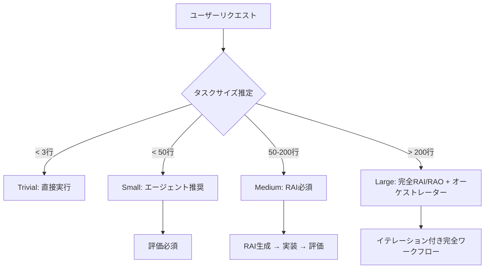

# Claude Code プロジェクト設定ガイド


## 目次

- [概要](#概要)
- [1. 設定階層](#1-設定階層)
- [2. RAI/RAOフレームワーク](#2-riraoフレームワーク)
- [3. グローバルルール継承](#3-グローバルルール継承)
- [4. プロジェクトCLAUDE.md設定](#4-プロジェクトclaudemd設定)
- [5. プロジェクトconfig.yaml設定](#5-プロジェクトconfigyaml設定)
- [6. タスクサイズ分類](#6-タスクサイズ分類)
- [7. 品質保証ワークフロー](#7-品質保証ワークフロー)
- [8. 移行ガイド](#8-移行ガイド)
- [9. ベストプラクティス](#9-ベストプラクティス)
- [10. トラブルシューティング](#10-トラブルシューティング)

## 概要

このガイドは、RAI/RAOフレームワークと階層的ルール継承による品質保証に焦点を当てた、Claude Codeプロジェクトの設定システムを定義します。

### アーキテクチャ原則 (v2.0)

```
グローバルルール (CLAUDE.md) → プロジェクトルール → RAI/RAO → 評価
```

### 設定ファイル

| ファイル | 場所 | 目的 | 優先度 |
|---------|------|------|--------|
| **グローバル CLAUDE.md** | `~/.claude/CLAUDE.md` | 普遍的ルール、RAI/RAOフレームワーク | 継承 |
| **プロジェクト CLAUDE.md** | `project/CLAUDE.md` | プロジェクト固有の拡張 | 最高 |
| **グローバル config.yaml** | テンプレートのみ | 標準設定テンプレート | ベース |
| **プロジェクト config.yaml** | `project/.claude/config.yaml` | RAI設定を含むプロジェクト設定 | プロジェクト |
| **settings.json** | `~/.claude/settings.json` または `.claude/settings.json` | Hooks設定 | ランタイム |

---

## 1. 設定階層

### 優先順位（高い順）

```
1. プロジェクト CLAUDE.md（グローバルを拡張、置換しない）
   ↓
2. グローバル CLAUDE.md（コアルール - 常に適用）
   ↓
3. プロジェクト config.yaml（RAI/RAO設定、エージェントマッピング）
   ↓
4. スキル（config.yaml に従って読み込み）
```

### 重要原則：拡張であり置換ではない

プロジェクト設定はグローバルルールを**拡張**し、決して置換しません。これにより以下が保証されます：
- すべてのプロジェクトで一貫した品質基準
- RAI/RAOフレームワークが常に利用可能
- コア委譲マッピングの保持

---

## 2. RAI/RAOフレームワーク

### RAI/RAOとは？

**RAI (Requirement Achievement Indicators)**: 成果物評価のための測定可能な基準
**RAO (Requirement Achievement Objectives)**: 実装のための明確な目標

### RAI/RAOが必要な場合

| タスクサイズ | コード行数 | RAI必須 | 評価必須 |
|-------------|-----------|---------|----------|
| **Trivial** | < 3 | いいえ | いいえ |
| **Small** | < 50 | いいえ | はい |
| **Medium** | 50-200 | **はい** | はい |
| **Large** | > 200 | **はい（完全）** | はい |

### RAI文書構造

```yaml
# RAI-2025-11-08-001.yaml
requirement_achievement:
  task_classification:
    size: medium
    complexity: medium

  indicators:  # RAI - 測定項目
    completeness:
      - id: "RAI-COMP-001"
        indicator: "すべてのAPIエンドポイント実装"
        measurement_method: "エンドポイントテストカバレッジ"
        pass_threshold: "100%"
        priority: must

  objectives:  # RAO - 達成目標
    primary:
      - id: "RAO-PRIM-001"
        objective: "ユーザー認証の完成"
        success_definition: "ユーザーがログイン/ログアウト可能"

  evaluation_protocol:
    agent: deliverable-evaluator
    input: "このRAI文書"
```

---

## 3. グローバルルール継承

### 必須グローバルルール（`~/.claude/CLAUDE.md`から）

すべてのプロジェクトは以下のルールを自動的に継承します：

1. **タスクサイズ分類マトリックス**
2. **RAI/RAOフレームワーク要件**
3. **5ツールチェックルール**
4. **エージェント委譲マッピング**
5. **品質ゲート**

### 継承の仕組み

```yaml
# プロジェクト CLAUDE.md内（必須構造）

## 🔗 グローバルルール継承（必須 - 削除禁止）

このプロジェクトは ~/.claude/CLAUDE.md のすべてのグローバルルールを継承します

### ✅ コアグローバルルール（常に適用）
1. RAI/RAOフレームワーク（セクション11-12）
2. オーケストレーター決定マトリックス（セクション11）
3. 5ツールチェックルール（セクション2）
4. 委譲マッピング（セクション4）

---

## プロジェクト固有の拡張
[ここにプロジェクト固有ルール - 拡張のみ、置換不可]
```

---

## 4. プロジェクトCLAUDE.md設定

### 必須構造

```markdown
# プロジェクト固有Claude Codeガイドライン

## 🔗 グローバルルール継承（必須 - 削除禁止）
[継承宣言 - テンプレート参照]

## 📋 プロジェクト概要
[プロジェクト説明]

## 🛠️ 技術スタック
[使用技術]

## 📐 プロジェクト固有ルール
[グローバルルールを拡張するルール]

## 🔄 RAI/RAOフレームワーク使用
[プロジェクト固有の調整 - グローバル要件を緩和不可]

## ✅ 品質ゲート
すべてのグローバルゲートプラス：
- [ ] プロジェクト固有要件

## ⚠️ 重要な注意事項
1. このファイルは拡張のみ、グローバルルールを置換しない
2. 疑問時はグローバルルール優先
3. 完全なグローバルルールは ~/.claude/CLAUDE.md を確認
```

### 含めるべき内容

✅ **含めるべき：**
- プロジェクト固有の規約
- 追加の品質ゲート
- カスタムワークフロー
- 技術固有パターン
- ビジネスドメインルール

❌ **含めてはいけない：**
- 言語標準（→ スキル）
- フレームワーク規約（→ スキル）
- 汎用パターン（→ グローバルまたはスキル）
- グローバルルールの緩和

---

## 5. プロジェクトconfig.yaml設定

### RAI/RAOのための必須セクション

```yaml
# .claude/config.yaml

# 必須：品質保証設定
quality_assurance:
  rai_rao_enabled: true

  task_size_thresholds:
    trivial:
      lines_of_code: 3
      rai_required: false
    small:
      lines_of_code: 50
      rai_required: false
      evaluation_required: true
    medium:
      lines_of_code: 200
      rai_required: true      # 必須
      evaluation_required: true
    large:
      lines_of_code: 201
      rai_required: true      # 必須
      workflow_orchestrator: mandatory

# 必須：RAIサポート付きエージェントスキル
agent_skills:
  requirement-analyst:
    - generic/requirement-analyzer  # RAI/RAO含む

  deliverable-evaluator:
    - generic/evaluation-criteria   # RAI対応評価

# 必須：ワークフローパス
workflow:
  documentation:
    structure:
      requirements: ".work/requirements/"  # RAI文書
      evaluation_history: ".work/evaluation-history.yaml"
      metrics: ".work/metrics.yaml"
```

### エージェント強制ポリシー

```yaml
agent_enforcement:
  enabled: true
  policy: "agent-first"

  required_agents:
    requirement_analysis:
      agent: requirement-analyst
      description: "中規模/大規模タスクのRAI/RAO生成"
      triggers:
        task_patterns:
          - "新機能実装"
          - "アーキテクチャ変更"
```

---

## 6. タスクサイズ分類

### サイズに基づく自動ルーティング



### サイズ推定ガイドライン

- **Trivial**: タイポ修正、空白、単一変数名変更
- **Small**: 単一関数、1ファイル内のバグ修正
- **Medium**: 複数関数、ファイル間変更
- **Large**: 新機能、アーキテクチャ変更、モジュール

---

## 7. 品質保証ワークフロー

### 標準ワークフロー（全プロジェクト）

```
1. タスク分類
   ↓
2. RAI生成（中規模/大規模の場合）
   ↓
3. 実装（適切なエージェント使用）
   ↓
4. RAIに対する評価
   ↓
5. イテレーション（必要時、最大3回）
```

### メトリクス追跡

プロジェクトは以下を自動追跡：
- エージェント使用率
- RAIコンプライアンス率
- 評価合格率
- 平均イテレーション数

メトリクスアクセス：
```bash
~/.claude/scripts/metrics-collector.sh
```

---

## 8. 移行ガイド

### 既存プロジェクトの場合

1. **CLAUDE.mdに継承セクション追加：**
```markdown
## 🔗 グローバルルール継承（必須 - 削除禁止）
[テンプレートからコピー]
```

2. **config.yamlにquality_assurance追加：**
```yaml
quality_assurance:
  rai_rao_enabled: true
  task_size_thresholds:
    [テンプレートからコピー]
```

3. **agent_skills更新：**
```yaml
agent_skills:
  requirement-analyst:
    - generic/requirement-analyzer  # RAI/RAO含む
```

4. **.work構造作成：**
```bash
mkdir -p .work/requirements
touch .work/evaluation-history.yaml
touch .work/metrics.yaml
```

---

## 9. ベストプラクティス

### DO's ✅

1. **常に最初にタスクサイズを確認**
2. **中規模/大規模タスクでRAI生成**
3. **TodoWriteで進捗追跡**
4. **RAIに対して成果物評価**
5. **RAI文書を.work/requirements/に保存**
6. **コミットメッセージでRAI参照**

### DON'Ts ❌

1. **中規模/大規模タスクでRAIをスキップしない**
2. **グローバル要件を緩和しない**
3. **評価をバイパスしない**
4. **5ツールチェックを無視しない**
5. **グローバルルールを置換しない**

### コミットメッセージフォーマット

```
type: description [RAI-YYYY-MM-DD-XXX]
```

例：
- `feat: ユーザー認証追加 [RAI-2025-11-08-001]`
- `fix: タイムアウト解決 [RAI-2025-11-08-002]`

---

## 10. トラブルシューティング

### よくある問題と解決策

#### 問題：中規模タスクでRAI生成されない
**解決策**：config.yamlで`quality_assurance.rai_rao_enabled: true`を確認

#### 問題：評価がスキップされる
**解決策**：`deliverable-evaluator`がRAI文書パスを持っていることを確認

#### 問題：グローバルルールが適用されない
**解決策**：プロジェクトCLAUDE.mdに継承セクション追加

#### 問題：メトリクスが収集されない
**解決策**：`.work/`ディレクトリ構造を作成

### 検証チェックリスト

- [ ] プロジェクトCLAUDE.mdに継承セクションあり
- [ ] config.yamlにquality_assuranceセクションあり
- [ ] .work/requirements/ディレクトリ存在
- [ ] requirement-analystスキルにRAI/RAO含む
- [ ] deliverable-evaluatorがRAI対応

### サポートコマンド

```bash
# 設定確認
cat .claude/config.yaml | grep -A10 quality_assurance

# RAI文書確認
ls -la .work/requirements/

# メトリクス表示
cat .work/metrics.yaml

# 評価履歴分析実行
~/.claude/scripts/feedback-analyzer.sh
```

---

## テンプレート

完全なテンプレートはこちら：
- `~/.dotfiles/.claude/projects/template/CLAUDE.md`
- `~/.dotfiles/.claude/projects/template/config.yaml`
- `~/.dotfiles/.claude/projects/template/.claude/settings.json`

## バージョン履歴

- **v2.0.0** (2025-11-08): RAI/RAOフレームワーク、グローバル継承
- **v1.0.0**: 初期スキル駆動アーキテクチャ

## ライセンス

MIT License - 詳細はLICENSEファイルを参照
