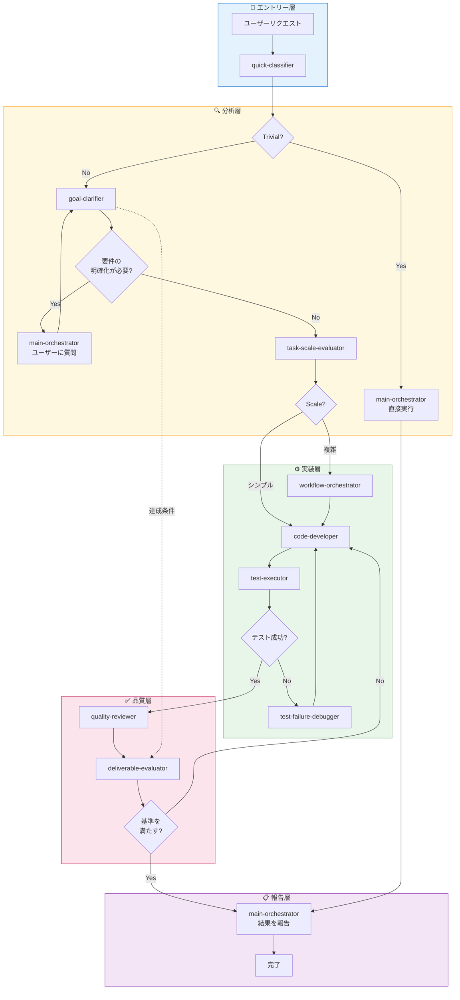

# Claude Code エージェントオーケストレーションシステム

[](https://opensource.org/licenses/MIT)
[](https://claude.ai/code)
[](#)
[](#)
[](#)
[](#)
[](https://claude.ai)

Claude Code向けのマルチエージェントオーケストレーションシステムです。スキル駆動型アーキテクチャにより、複数のプロジェクトや技術スタックにわたって一貫性のある再利用可能なAI支援開発を実現します。

## 目次

- [はじめに](#はじめに)
- [主な特徴](#主な特徴)
- [アーキテクチャワークフロー](#アーキテクチャワークフロー)
- [フック使用マトリクス](#フック使用マトリクス)
- [スキル使用マトリクス](#スキル使用マトリクス)
- [エージェント一覧](#エージェント一覧)
- [スキル一覧](#スキル一覧)
- [使い方](#使い方)
- [設定](#設定)
- [ライセンス](#ライセンス)

## はじめに

本システムは、専門化されたエージェントが中央オーケストレーターを通じて協調する洗練されたマルチエージェントアーキテクチャを実装しています。**2フェーズトリアージ**アプローチを採用し、受信したリクエストを効率的に分類して適切なハンドラーにルーティングすることで、最適なリソース利用と全操作にわたる一貫した品質を確保します。

## 主な特徴

- **2フェーズトリアージ**: 深い分析の前に効率的なリクエスト分類を実行
- **スキルベースの適応**: 汎用エージェントがロード可能なスキルを通じてあらゆる技術に適応
- **関心の分離**: エージェント間の明確な責任境界
- **品質ゲート**: 組み込みのレビューと評価チェックポイント
- **マルチプロジェクト対応**: プロジェクト固有のオーバーライドが可能な集中設定

## アーキテクチャワークフロー



### 直接実行の制限（トリビアルタスク）

| 制限項目 | 値 |
|---------|-----|
| max_file_reads | 3 |
| max_search_iterations | 2 |
| allowed_operations | read, search, list |

## フック使用マトリクス

### エージェントフック（チェイン制御のみ）

| Agent | SessionStart | PreToolUse | SubagentStop | Stop |
|-------|:------------:|:----------:|:------------:|:----:|
| quick-classifier | - | - | - | - |
| goal-clarifier | - | - | 💬 | - |
| main-orchestrator | - | - | - | 💬 |
| task-scale-evaluator | - | - | 💬 | - |
| design-architect | - | - | 💬 | - |
| code-developer | - | 💬 | 💬 | - |
| test-strategist | - | - | 💬 | - |
| test-executor | - | - | 💬 | - |
| test-failure-debugger | - | - | 💬 | - |
| quality-reviewer | - | - | 💬 | - |
| deliverable-evaluator | 💬 | 💬 | 💬 | - |
| workflow-orchestrator | - | - | 💬 | - |

### スキルフック（設定読み込み＆バリデーション）

| Skill | SessionStart | PostToolUse |
|-------|:------------:|:-----------:|
| generic/test-implementer | ⌘ (testing rules) | - |
| generic/task-scaler | ⌘ (scale config) | - |
| typescript/coding-standards | ⌘ (coding standards) | ⌘ (eslint) |
| php/coding-standards | ⌘ (coding standards) | ⌘ (php -l) |

**凡例:** ⌘ = シェルスクリプトフック (yqで設定読み込み), 💬 = プロンプト注入フック

### アーキテクチャ原則

- **スキル**: `.claude/config.yaml`から`yq`経由でプロジェクト固有ルールを読み込み
- **エージェント**: チェイン制御のみ（SubagentStop、Stop）- ルールベースフックなし

> **例外**: deliverable-evaluatorはプロンプトから評価コンテキストを読み込むためのSessionStartプロンプトフックを持つ（設定読み込みではない）


## スキル使用マトリクス

### 汎用スキル

| Agent | req-analyzer | accept-criteria | workflow-pat | task-scaler | deleg-router | design-pat | test-impl | code-rev | compl-eval | eval-criteria | deliv-valid | git-op |
|-------|:---:|:---:|:---:|:---:|:---:|:---:|:---:|:---:|:---:|:---:|:---:|:---:|
| quick-classifier | - | - | - | - | - | - | - | - | - | - | - | - |
| goal-clarifier | ✅️ | ✅️ | - | - | - | - | - | - | - | - | - | - |
| main-orchestrator | - | - | ✅️ | ✅️ | ✅️ | - | - | - | - | - | - | - |
| task-scale-evaluator | ✅️ | - | - | ✅️ | - | - | - | - | - | - | - | - |
| design-architect | - | - | - | - | - | ✅️ | - | - | - | - | - | - |
| code-developer | - | - | - | - | - | - | - | - | - | - | - | - |
| test-strategist | - | - | - | - | - | - | - | - | - | - | - | - |
| test-executor | - | - | - | - | - | - | ✅️ | - | - | - | - | - |
| test-failure-debugger | - | - | - | - | - | - | - | - | - | - | - | - |
| quality-reviewer | - | - | - | - | - | - | - | ✅️ | - | - | - | - |
| deliverable-evaluator | - | - | - | - | - | - | - | - | ✅️ | ✅️ | ✅️ | - |
| workflow-orchestrator | - | - | - | - | - | - | - | - | - | - | - | ✅️ |

**凡例:** req-analyzer = requirement-analyzer, accept-criteria = acceptance-criteria, workflow-pat = workflow-patterns, deleg-router = delegation-router, design-pat = design-patterns, test-impl = test-implementer, code-rev = code-reviewer, compl-eval = completion-evaluator, eval-criteria = evaluation-criteria, deliv-valid = deliverable-validator, git-op = git-operator

### 言語/フレームワーク固有スキル（プロジェクトごとに設定）

| Agent | 設定からロード |
|-------|----------------|
| code-developer | `language/*`, `framework/*` (例: php/coding-standards, typescript-react/code-implementer) |
| test-strategist | `language/testing-standards`, `framework/test-*` |
| quality-reviewer | `language/*-standards`, `framework/code-reviewer` |
| design-architect | `framework/*-designer` |

## エージェント一覧

| Agent | 責務 | アクション |
|-------|------|----------|
| quick-classifier | リクエスト分類 | 直接実行可否の判定 |
| goal-clarifier | 要件分析 | 達成条件の定義、不明点の質問 |
| main-orchestrator | タスクルーティング | 適切なエージェントへの委譲 |
| task-scale-evaluator | 複雑性評価 | 単純/複雑の判定 |
| design-architect | アーキテクチャ設計 | 技術設計とパターン選定 |
| code-developer | コード実装 | スキルに従ったコード記述 |
| test-strategist | テスト計画 | テスト方針とケース設計 |
| test-executor | テスト実行 | テスト実行と合否判定 |
| test-failure-debugger | 失敗分析 | 原因調査と修正提案 |
| quality-reviewer | 品質レビュー | コード品質とセキュリティ確認 |
| deliverable-evaluator | 受入検証 | 達成条件との照合 |
| workflow-orchestrator | ワークフロー調整 | 複数エージェントの協調管理 |

## スキル一覧

### 汎用スキル (12)

| Skill | 説明 |
|-------|------|
| acceptance-criteria | 受入基準パターンと検証ルールを定義 |
| code-reviewer | 汎用コードレビューパターンとチェックリスト |
| completion-evaluator | タスク完了検証基準 |
| delegation-router | エージェント委譲決定パターン |
| deliverable-validator | 成果物検証ルールと品質チェック |
| design-patterns | SOLID、DRY、KISS、およびアーキテクチャパターン |
| evaluation-criteria | 最終評価基準とメトリクス |
| git-operator | Git操作パターンとコミットメッセージ標準 |
| requirement-analyzer | 要件分析とドキュメントパターン |
| task-scaler | タスク複雑性評価基準 |
| test-implementer | テスト実装パターンとベストプラクティス |
| workflow-patterns | マルチステップワークフロー調整パターン |

### PHP スキル (3)

| Skill | 説明 |
|-------|------|
| coding-standards | PSR-12コーディング標準とPHPベストプラクティス |
| security-patterns | OWASPパターン、入力検証、SQLインジェクション防止 |
| testing-standards | PHPUnitベストプラクティスとテストパターン |

### PHP-CakePHP スキル (12)

| Skill | 説明 |
|-------|------|
| code-implementer | CakePHP MVC実装パターン |
| code-reviewer | CakePHP固有のコードレビューチェックリスト |
| database-designer | CakePHP向けデータベーススキーマ設計 |
| fixture-generator | テストフィクスチャ生成パターン |
| functional-designer | 機能仕様設計 |
| migration-checker | マイグレーション検証と確認 |
| multi-tenant-db-handler | マルチテナントデータベースパターン |
| refactoring-advisor | CakePHPリファクタリング推奨事項 |
| requirement-analyzer | CakePHP固有の要件分析 |
| test-case-designer | CakePHP向けテストケース設計 |
| test-validator | テスト品質・仕様検証 |

### TypeScript スキル (10)

| Skill | 説明 |
|-------|------|
| typescript/coding-standards | TypeScriptコーディング標準とベストプラクティス |
| typescript-react/architectural-patterns | Reactアーキテクチャパターンとコンポーネント設計 |
| typescript-react/code-implementer | Reactコンポーネント実装パターン |
| typescript-react/code-reviewer | React固有のコードレビューチェックリスト |
| typescript-react/testing-standards | Jest/RTLを使用したReactテストパターン |
| typescript-nextjs/code-implementer | Next.js実装パターン |
| typescript-nextjs/code-reviewer | Next.js固有のコードレビューチェックリスト |
| typescript-nextjs/deliverable-criteria | Next.js成果物検証基準 |
| typescript-react-query/patterns | React Query/TanStack Queryパターン |
| typescript-zustand/patterns | Zustand状態管理パターン |

## 使い方

### 1. テンプレートをプロジェクトにコピー

```bash
# CLAUDE.mdテンプレートをコピー
cp ~/.claude/templates/CLAUDE.md /path/to/project/CLAUDE.md

# config.yamlテンプレートをコピー
mkdir -p /path/to/project/.claude
cp ~/.claude/templates/.claude/config.yaml /path/to/project/.claude/config.yaml
```

### 2. プロジェクトを設定

`CLAUDE.md`をプロジェクト固有のルールで編集:
- ビジネスルールと制約
- 禁止パターンとその理由
- 品質ゲートと要件

`.claude/config.yaml`を技術設定で編集:
- 技術スタックの指定
- エージェントスキルの割り当て
- テストコマンドの設定

### 3. Claude Codeの使用開始

main-orchestratorが自動的にリクエストを分類し、適切にルーティングします。

## 設定

設定は各プロジェクトの`.claude/config.yaml`で管理されます。

**必須セクション:**
1. `agents.*` - どのスキルがどのエージェントで使用されるか
2. `skills.*` - スキル固有のカスタマイズルール
3. `testing.*` - テスト実行設定
4. `git.*` - Git操作設定

```yaml
# Agent-Skill 割り当て（技術スタックを暗黙的に定義）
agents:
  code-developer:
    skills:
      - php/coding-standards
      - php-cakephp/code-implementer
  quality-reviewer:
    skills:
      - generic/code-reviewer
      - php-cakephp/test-validator

# スキル固有の設定
skills:
  test-validator:
    enabled: true
    rules:
      require_guarantee_section: true
  code-reviewer:
    focus_areas:
      security: true
      performance: true
      maintainability: true
    severity:
      block_on: [critical, security]
      warn_on: [minor]

# Git設定
git:
  operations:
    commit: auto          # auto|user_request_only|prohibited
    push: user_request_only
  commit_message:
    format: conventional  # conventional|simple|custom

# テスト設定
testing:
  command: "docker compose run --rm web vendor/bin/phpunit"
  rules:
    documentation: "tests/README.md"
```

### プロジェクト情報の配置場所

| 情報 | 配置場所 |
|------|----------|
| Agent-Skill 割り当て | `.claude/config.yaml` |
| スキルカスタマイズルール | `.claude/config.yaml` |
| テストコマンド | `.claude/config.yaml` |
| ビジネスルール、禁止パターン | `CLAUDE.md` |
| プロジェクト固有のテストルール | `tests/README.md` |
| 技術スタック、アーキテクチャ | `CLAUDE.md` |

### スキルのロード順序

スキルは優先順位に従ってロードされます（後のものが前のものをオーバーライド）:

1. `generic/*` - ベースとなる汎用パターン
2. `{language}/*` - 言語固有のパターン
3. `{language}-{framework}/*` - フレームワーク固有のパターン

## ライセンス

MIT License - 詳細は[LICENSE](LICENSE)ファイルを参照してください。

---

**バージョン**: 2.0.0
**最終更新日**: 2025-01-11
