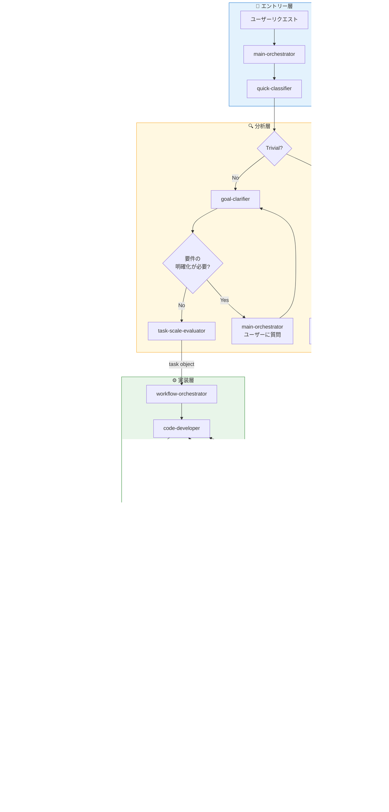

# Claude Code エージェントオーケストレーションシステム

[](https://opensource.org/licenses/MIT)
[](https://claude.ai/code)
[](#)
[](#)
[](#)
[](#)
[](https://claude.ai)

Claude Code向けのマルチエージェントオーケストレーションシステムです。スキル駆動型アーキテクチャにより、複数のプロジェクトや技術スタックにわたって一貫性のある再利用可能なAI支援開発を実現します。

## このシステムを使う理由

Claude Codeで複雑なプロジェクトを扱う際、以下のような課題に直面することがあります：

| 課題 | このシステムなし | このシステムあり |
|------|-----------------|-----------------|
| **品質のばらつき** | AIがテストやレビューをスキップすることがある | 完了前に品質ゲートを強制 |
| **繰り返しの説明** | 毎セッションでプロジェクトルールを再説明 | 設定からルールを自動読み込み |
| **複雑なタスク処理** | 大きなタスクを手動で分解 | 専門エージェントへ自動ルーティング |
| **技術スタックの切替** | スタックごとに異なるプロンプト | スキルがエージェントをあらゆる技術に適応 |

## 目次

- [クイックスタート](#クイックスタート)
- [主な特徴](#主な特徴)
- [インストール](#インストール)
- [使い方](#使い方)
- [設定](#設定)
- [アーキテクチャ概要](#アーキテクチャ概要)
- [リファレンス](#リファレンス)
- [ライセンス](#ライセンス)

## クイックスタート

```bash
# 1. ~/.claude/ にクローン
git clone https://github.com/your-repo/claude-orchestration.git ~/.claude

# 2. yq をインストール（設定読み込みに必要）
brew install yq

# 3. プロジェクト設定を作成
mkdir -p /path/to/your/project/.claude
cp ~/.claude/templates/.claude/config.yaml /path/to/your/project/.claude/

# 4. (オプション) プロジェクト固有のコンテキスト用にCLAUDE.mdを作成
# ビジネスルール、禁止パターン、アーキテクチャの決定事項を追加

# 5. Claude Codeを起動
cd /path/to/your/project
claude
```

これだけです！完全なオーケストレーションシステムが必要な場合は `/dev-workflow` を使用します。

## 主な特徴

| 機能 | 説明 |
|------|------|
| **オンデマンドワークフロー** | `/dev-workflow` コマンドで起動 - 常時有効ではない |
| **スキルベースの適応** | 同じエージェントがPHP、TypeScript、Reactなど様々な技術にスキル経由で対応 |
| **品質ゲート** | 自動コードレビューと受入基準の検証 |
| **設定としてのプロジェクトルール** | YAMLで制約を定義し、自動的に強制 |
| **マルチプロジェクト対応** | 1つのシステムで、異なる技術スタックの複数プロジェクトに対応 |

## インストール

### 前提条件

- [Claude Code](https://docs.anthropic.com/en/docs/claude-code) - AnthropicのCLIツール
- **yq** - YAMLプロセッサ（スキルが設定を読み込むために使用）
  ```bash
  brew install yq   # macOS
  # または: pip install yq
  ```

### セットアップ

```bash
# このリポジトリを ~/.claude/ にクローン
git clone https://github.com/your-repo/claude-orchestration.git ~/.claude

# インストールを確認
ls ~/.claude/agents/    # エージェント定義が表示されるはず
ls ~/.claude/skills/    # スキル定義が表示されるはず
```

## 使い方

### 1. プロジェクト設定を作成

```bash
mkdir -p /path/to/project/.claude
cp ~/.claude/templates/.claude/config.yaml /path/to/project/.claude/config.yaml
```

### 2. プロジェクトを設定

**`.claude/config.yaml`** - 機械が読む設定：
- エージェントのスキル割り当て（技術スタックを定義）
- テストコマンド
- 自然言語による制約ルール

**(オプション) `CLAUDE.md`** - 人間が読むプロジェクトコンテキスト：
- 理由とコード例を含むビジネスルール
- 説明付きの禁止パターン
- アーキテクチャの決定事項

### 3. Claude Codeを起動

```bash
cd /path/to/project
claude
```

デフォルトでは、Claude Codeは直接実行モードで動作します。複雑なタスクには：

```
/dev-workflow
JWT認証でユーザー認証機能を実装してください。

要件:
- ログイン/ログアウトエンドポイント
- トークンリフレッシュ機能
- セッション管理
```

`/dev-workflow` コマンドは：
1. `main-orchestrator` エージェントを起動
2. リクエストを分類してルーティング
3. 完了前に品質ゲートを強制

## 設定

設定は`.claude/config.yaml`に配置します。各セクションの役割：

| セクション | 用途 | 例 |
|-----------|------|-----|
| `agents.*` | 各エージェントがロードするスキル | `code-developer: [php/coding-standards]` |
| `constraints.*` | 開発中に強制されるルール | 自然言語による禁止事項 |
| `testing.*` | テスト実行設定 | Dockerコマンド、ドキュメントパス |
| `git.*` | Git操作ポリシー | auto/user_request_only/prohibited |

### 設定例

```yaml
# エージェントのスキルで技術スタックを定義
agents:
  code-developer:
    skills:
      - generic/safe-editing
      - php/coding-standards
      - php-cakephp/code-implementer

# プロジェクト制約（自然言語ルール）
constraints:
  architecture:
    layers:
      - "Controllerにビジネスロジックを含めてはならない"
    dependencies:
      - "Model間の循環依存は禁止"
  testing:
    prohibited:
      - "本番コードをモックしてはならない"

# Git設定
git:
  operations:
    commit: user_request_only
    push: user_request_only
```

`generic/safe-editing` はWrite/Editを使う可能性のあるエージェントにデフォルトで付与し、安全な編集手順（差分確認や影響範囲の明示など）を標準化する意図で運用します。

### 情報の配置場所

| 情報 | 配置場所 | 必須 |
|------|----------|-----|
| エージェントのスキル割当 | `.claude/config.yaml` | Yes |
| ルールとしての制約 | `.claude/config.yaml` | Yes |
| テストコマンド | `.claude/config.yaml` | Yes |
| コード例付きのビジネスルール | `CLAUDE.md` (オプション) | No |

## アーキテクチャ概要

オーケストレーションシステムは `/dev-workflow` コマンドで起動します。これにより `main-orchestrator` エージェントが以下のワークフローを調整します。



**データフロー**: `task`オブジェクト（`acceptance_criteria`を含む）がGC → TSE → WO → DEへprompt経由で流れます。

### 動作の仕組み

`/dev-workflow` を実行すると：

1. **エントリー**: リクエストが`main-orchestrator`エージェントに送られる
2. **分類**: `quick-classifier`がリクエストが単純か複雑かを判定
3. **トリアージ**: 単純なタスクは直接実行、複雑なものは`goal-clarifier`（`acceptance_criteria`を含む`task`を定義）を経由
4. **実装**: `task-scale-evaluator`が`task`オブジェクトを`workflow-orchestrator`に渡し、`code-developer` → `test-executor`を管理
5. **品質**: `quality-reviewer`がコードをチェック、`deliverable-evaluator`が`task`から`acceptance_criteria`を抽出して検証
6. **報告**: 結果があなたに返される

**注意**: `goal-clarifier`がユーザー入力を必要とする場合、質問を`main-orchestrator`に返し、MOがユーザーに質問してGCを再開します。

**`/dev-workflow`なしの場合**: Claude Codeは直接実行モードで動作し、すべてのツールにアクセスできます。

### 主要エージェント

| エージェント | 役割 |
|-------------|------|
| quick-classifier | リクエストが単純か複雑かを判定 |
| goal-clarifier | `acceptance_criteria`を含む`task`オブジェクトを定義 |
| code-developer | ロードされたスキルに従ってコードを記述 |
| test-executor | テストを実行し結果を報告 |
| quality-reviewer | コード品質とセキュリティをレビュー |
| deliverable-evaluator | `task`から`acceptance_criteria`を抽出して評価 |

## リファレンス

<details>
<summary><strong>エージェント一覧（12エージェント）</strong></summary>

| Agent | 責務 | アクション |
|-------|------|----------|
| quick-classifier | リクエスト分類 | 直接実行可否の判定 |
| goal-clarifier | 要件分析 | 達成条件の定義 |
| main-orchestrator | タスクルーティング | 適切なエージェントへの委譲 |
| task-scale-evaluator | 複雑性評価 | 単純/複雑の判定 |
| design-architect | アーキテクチャ設計 | 技術設計とパターン選定 |
| code-developer | コード実装 | スキルに従ったコード記述 |
| test-strategist | テスト計画 | テスト方針とケース設計 |
| test-executor | テスト実行 | テスト実行と合否判定 |
| test-failure-debugger | 失敗分析 | 原因調査と修正提案 |
| quality-reviewer | 品質レビュー | コード品質とセキュリティ確認 |
| deliverable-evaluator | 受入検証 | 達成条件との照合 |
| workflow-orchestrator | ワークフロー調整 | 複数エージェントの協調管理 |

</details>

<details>
<summary><strong>スキル一覧（38スキル）</strong></summary>

### 汎用スキル (13)

| Skill | 説明 |
|-------|------|
| acceptance-criteria | 受入基準パターン |
| code-reviewer | 汎用コードレビューパターン |
| completion-evaluator | タスク完了検証 |
| delegation-router | エージェント委譲パターン |
| deliverable-validator | 成果物検証ルール |
| design-patterns | SOLID、DRY、KISSパターン |
| evaluation-criteria | 最終評価基準 |
| git-operator | Git操作パターン |
| requirement-analyzer | 要件分析パターン |
| safe-editing | 影響範囲の確認と安全な編集手順 |
| task-scaler | タスク複雑性評価 |
| test-implementer | テスト実装パターン |
| workflow-patterns | ワークフロー調整パターン |

### PHP スキル (3)

| Skill | 説明 |
|-------|------|
| coding-standards | PSR-12とPHPベストプラクティス |
| security-patterns | OWASP、入力検証 |
| testing-standards | PHPUnitベストプラクティス |

### PHP-CakePHP スキル (12)

| Skill | 説明 |
|-------|------|
| code-implementer | CakePHP MVCパターン |
| code-reviewer | CakePHPコードレビュー |
| database-designer | データベーススキーマ設計 |
| fixture-generator | テストフィクスチャ生成 |
| functional-designer | 機能仕様設計 |
| migration-checker | マイグレーション検証 |
| multi-tenant-db-handler | マルチテナントパターン |
| refactoring-advisor | リファクタリング推奨 |
| requirement-analyzer | CakePHP要件分析 |
| test-case-designer | テストケース設計 |
| test-validator | テスト品質検証 |

### TypeScript スキル (10)

| Skill | 説明 |
|-------|------|
| typescript/coding-standards | TypeScriptベストプラクティス |
| typescript-react/* | Reactパターン（5スキル） |
| typescript-nextjs/* | Next.jsパターン（3スキル） |
| typescript-react-query/patterns | TanStack Queryパターン |
| typescript-zustand/patterns | Zustand状態管理パターン |

</details>

<details>
<summary><strong>フック使用マトリクス（上級者向け）</strong></summary>

### エージェントフック

| Agent | SessionStart | PreToolUse | SubagentStop | Stop |
|-------|:------------:|:----------:|:------------:|:----:|
| quick-classifier | - | - | - | - |
| goal-clarifier | - | - | ✅️ | - |
| main-orchestrator | - | - | - | ✅️ |
| task-scale-evaluator | - | - | ✅️ | - |
| design-architect | - | - | ✅️ | - |
| code-developer | - | ✅️ | ✅️ | - |
| test-strategist | - | - | ✅️ | - |
| test-executor | - | - | ✅️ | - |
| test-failure-debugger | - | - | ✅️ | - |
| quality-reviewer | - | - | ✅️ | - |
| deliverable-evaluator | ✅️ | ✅️ | ✅️ | - |
| workflow-orchestrator | - | - | ✅️ | - |

### スキルフック（設定読み込み）

| Skill | SessionStart | PostToolUse | config.yaml キー |
|-------|:------------:|:-----------:|-----------------|
| generic/git-operator | ✅️ | - | `.output.language`, `.git` |
| generic/test-implementer | ✅️ | - | `.testing`, `.constraints.testing` |
| generic/task-scaler | ✅️ | - | `.task_scaling.thresholds` |
| generic/code-reviewer | ✅️ | - | `.constraints` |
| php/coding-standards | ✅️ | ✅️ | `.coding_standards` |
| typescript/coding-standards | ✅️ | ✅️ | `.coding_standards` |
| php-cakephp/test-validator | ✅️ | - | `.constraints.testing`, `.constraints.schema` |
| php-cakephp/code-implementer | ✅️ | - | `.constraints.architecture` |
| php-cakephp/code-reviewer | ✅️ | - | `.constraints.architecture`, `.constraints` |

**アーキテクチャ原則:**
- **スキル**: `.claude/config.yaml`から`yq`経由でプロジェクト固有ルールを読み込み
- **エージェント**: チェイン制御のみ（SubagentStop、Stop）- ルールベースフックなし

</details>

<details>
<summary><strong>スキル使用マトリクス（上級者向け）</strong></summary>

| Agent | 使用スキル |
|-------|-----------|
| goal-clarifier | requirement-analyzer, acceptance-criteria |
| main-orchestrator | workflow-patterns, task-scaler, delegation-router |
| task-scale-evaluator | requirement-analyzer, task-scaler |
| design-architect | design-patterns, safe-editing |
| code-developer | safe-editing |
| test-strategist | safe-editing |
| test-executor | test-implementer |
| quality-reviewer | code-reviewer |
| deliverable-evaluator | completion-evaluator, evaluation-criteria, deliverable-validator |
| workflow-orchestrator | git-operator |

言語/フレームワーク固有スキル（例: `php-cakephp/*`）はconfig.yamlの`agents.*.skills`でプロジェクトごとに設定します。

</details>

## ライセンス

MIT License - 詳細は[LICENSE](LICENSE)ファイルを参照してください。

---

**バージョン**: 2.2.0
**最終更新日**: 2025-01-12
